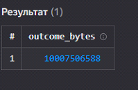

# lab 1

## Цель работы

1.  Изучить возможности технологии Yandex Query для анализа
    структурированных наборов данных
2.  Получить навыки построения аналитического пайплайна для анализа
    данных с помощью сервисов Yandex Cloud
3.  Закрепить практические навыки использования SQL для анализа данных
    сетевой активности в сегментированной корпоративной сети

## Исходные данные

1.  ОС Windows
2.  Cервисы Yandex Cloud
3.  RStudio

## План

1.  Проверить доступность данных в Yandex Object Storage
2.  Подключить бакет как источник данных для Yandex Query
3.  Провести анализ данных
4.  Создать отчет

## Описание шагов:

1.  **Проверьте доступность данных (файл yaqry_dataset.pqt) в бакете
    arrow-datasets S3 хранилища Yandex Object Storage.**

Для обращения к бакету и проверки доступности данных необходимо
сформировать ссылку следующего вида:
`https://storage.yandexcloud.net/bucket-name`.

В списке файлов есть файл датасета *yaqry_dataset.pqt* - он доступен по
ссылке
`https://storage.yandexcloud.net/arrow-datasets/yaqry_dataset.pqt`

1.  **Подключение бакета как источника данных для Yandex Query**

Перед проведением анализа нам надо связать Yandex Query с хранилищем
наших данных. В нашем случае это S3 Object Storage от Yandex Cloud.

Создать соединение для бакета в S3 хранилище

Заполняем поля с учетом допустимых символов, выбираем тип
аутентификации - публичный. Вводим имя бакета в соответствующее поле и
сохраняем.

Теперь, после создания соединения, укажем какой объект использовать в
качестве источника данных. Для этого нужно сделать привязку данных.

Проверка датасета

1.  **Анализ**

Известно, что IP адреса внутренней сети начинаются с октетов,
принадлежащих интервалу 12-14. Определите количество хостов внутренней
сети, представленных в датасете.

Определите суммарный объем исходящего трафика

Определите суммарный объем входящего трафикаОценка результата

В результате практической работы был проведен анализ сетевой активности
с помощью SQL.

## Оценка результатов

Задача выполнена при помощи облачных сервисов Yandex Cloud и технологии
Yandex Query, удалось познакомится с их функционалом и особенностями.

## Вывод

В данной работе я смог закрепить практические навыки использования SQL
для анализа данных сетевой активности в сегментированной корпоративной
сети и получить навыки построения аналитического пайплайна для анализа
данных.
